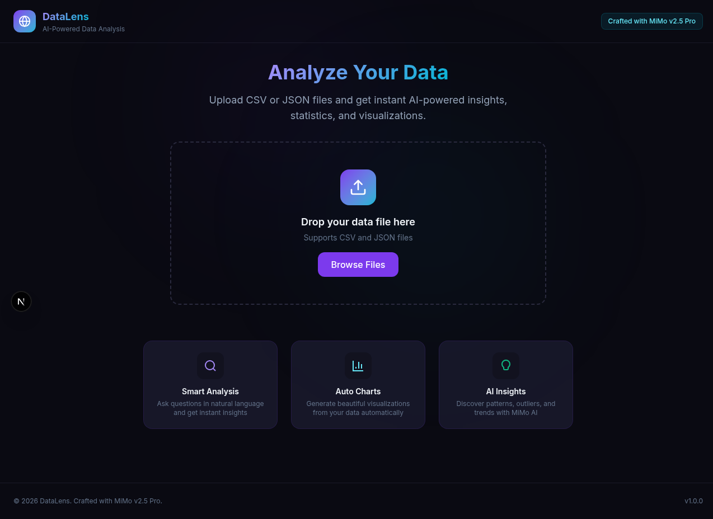

# 🔬 DataLens

**AI-Powered Data Analysis** — Upload CSV or JSON data, ask questions in natural language, and get instant AI-powered insights with beautiful visualizations.

> *Crafted with MiMo v2.5 Pro*



---

## ✨ Features

- **📁 File Upload** — Drag & drop CSV or JSON files for instant parsing
- **💬 AI Chat** — Ask questions about your data in natural language
- **📊 Auto Charts** — Generate visualizations automatically from your data
- **🔍 Smart Analysis** — Get statistics, patterns, outliers, and trends
- **📈 Data Preview** — View your data in a clean, sortable table

---

## 🛠 Tech Stack

| Layer | Technology |
|-------|-----------|
| Framework | Next.js 16 (App Router) |
| Styling | Tailwind CSS 4 |
| AI Engine | MiMo v2.5 Pro (Xiaomi) |
| Language | TypeScript |
| Charts | Recharts |

---

## 🚀 Getting Started

```bash
# Install dependencies
npm install

# Set environment variables
cp .env.example .env.local
# Edit .env.local with your MiMo API credentials

# Run development server
npm run dev
```

Open [http://localhost:3000](http://localhost:3000)

---

## ⚙️ Environment Variables

| Variable | Description | Default |
|----------|-------------|---------|
| `MIMO_API_URL` | MiMo API endpoint | `http://localhost:19911/v1/chat/completions` |
| `MIMO_API_KEY` | API key (required for Vercel) | _(empty)_ |

---

## 📁 Project Structure

```
src/
├── app/
│   ├── api/analyze/route.ts   # AI analysis endpoint
│   ├── globals.css             # Theme & styling
│   ├── layout.tsx              # Root layout
│   └── page.tsx                # Main page
├── components/
│   ├── ChartVisualization.tsx  # Chart rendering
│   ├── ChatInterface.tsx       # AI chat UI
│   ├── DataPreview.tsx         # Data table view
│   └── FileUpload.tsx          # Drag & drop upload
```

---

## 🎨 Theme

Dark glassmorphism with **purple** (#7c3aed) and **cyan** (#06b6d4) accent colors. Inter + JetBrains Mono fonts.

---

## 📜 License

MIT
